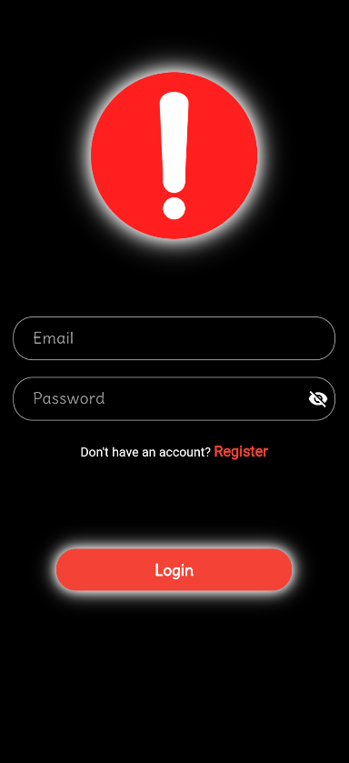
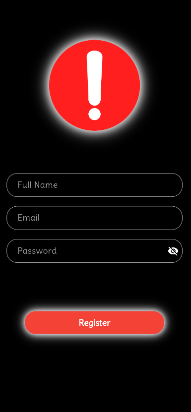
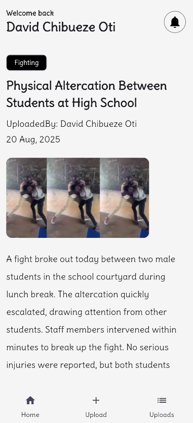
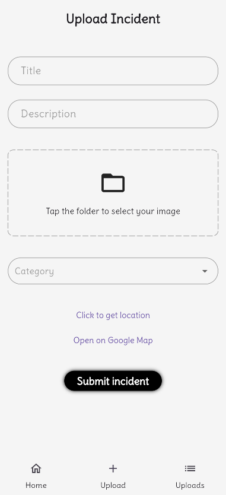
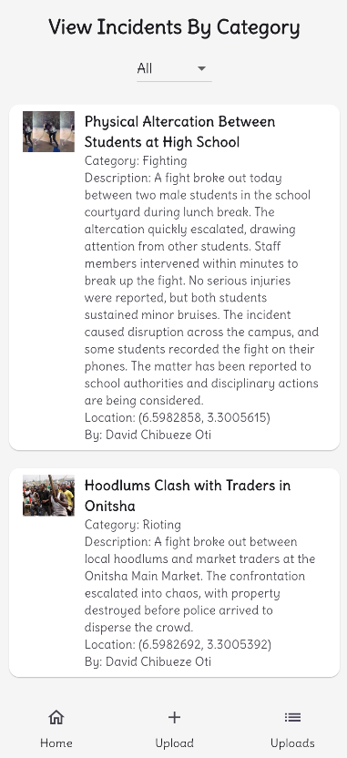
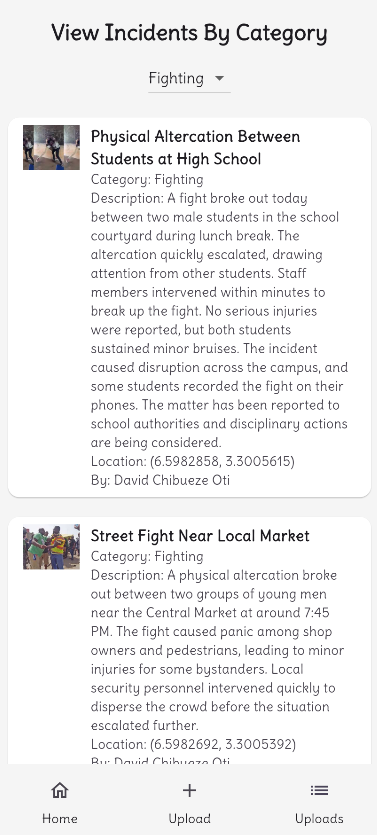

# 📱 Citizen Report Incident App

[](https://flutter.dev)
[](https://dart.dev)
[](https://supabase.com)
[](https://firebase.google.com)
[](https://bloclibrary.dev)
[](LICENSE)

A **Flutter mobile application** that enables users to report and track incidents in real-time.  
The app integrates with **Supabase** for authentication, database, and storage, and uses **Firebase Cloud Messaging (FCM)** for push notifications.  

---

## 🚀 Features
- 🔑 **User Authentication** (Register, Login, Session management with Supabase Auth)  
- 📝 **Report Incidents** with title, description, category, geolocation, and images  
- 📰 **View Feed** of all submitted incidents in real time  
- 🔔 **Push Notifications** when new incidents are reported  
- 📡 **Offline Handling** with network checks & user-friendly error messages  
- 🧩 **Clean Architecture** — UI → Bloc → UseCase → Repository → Remote Source  

---

## 🛠️ Tech Stack
- **Frontend**: Flutter & Dart  
- **State Management**: Bloc Pattern  
- **Backend**: Supabase (Auth, Database, Storage)  
- **Notifications**: Firebase Cloud Messaging (FCM)  
- **Dependency Injection**: GetIt  
- **Environment Management**: `.env` with `flutter_dotenv`  

---

## 📂 Project Structure
```bash
lib/
 ├── core/
 │   ├── routes/          # App routing (go_router)
 │   ├── service/         # Supabase, DI, local storage, connectivity
 │   └── utils/           # Helpers (snackbars, screen utils, etc.)
 ├── features/
 │   ├── auth/            # Login, Register, AuthBloc, repository
 │   ├── incidents/       # IncidentBloc, repository, remote sources, UI pages
 │   └── notifications/   # Notification use case
 ├── app.dart             # Root widget + routing
 └── main.dart            # App entry point, initialization

## ⚙️ Setup & Installation
git clone https://github.com/your-username/citizen-report-incident.git
cd citizen-report-incident


⚙️ Setup & Installation

Clone the repository

git clone https://github.com/your-username/citizen-report-incident.git
cd citizen-report-incident


Install dependencies

flutter pub get


Configure environment variables

Create a .env file in the root directory:

SUPABASE_URL=your-supabase-url
SUPABASE_ANON_KEY=your-supabase-anon-key


Ensure .env is included in pubspec.yaml under assets.

Run the app

flutter run


## 🔑 Key Implementation Highlights

Authentication Flow: Supabase Auth via AuthRemoteSource, with sessions cached in LocalStorageService.

Incident Upload Flow: Form → Bloc → Use Case → Repository → Supabase DB + Storage.

Notifications: FCM tokens stored in Supabase → new incidents trigger push alerts.

Error Handling: Remote exceptions mapped to domain Failure → surfaced by Bloc states.

# 📸 Screenshots









👤 Author
David (Dhayve)
Mobile & Backend Engineer

📄 License
This project is licensed under the MIT License. See the LICENSE
 file for details.